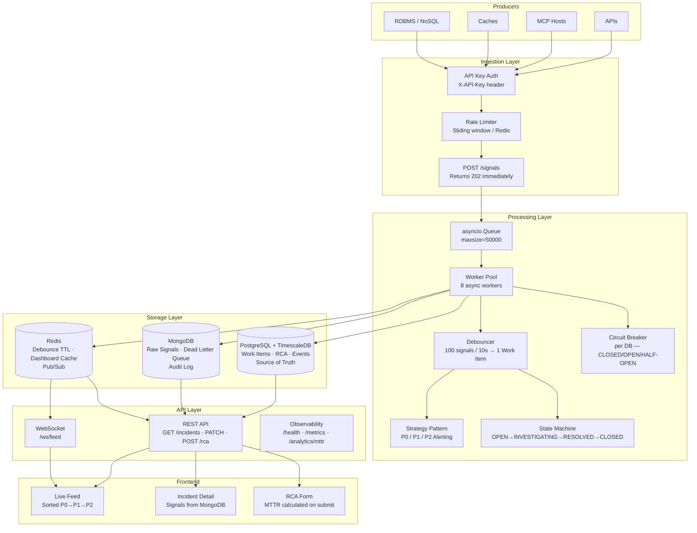

# IMS - Incident Management System

A production-grade, mission-critical Incident Management System built to monitor distributed infrastructure (APIs, MCP Hosts, Caches, Queues, RDBMS, NoSQL) and manage the full incident lifecycle from signal ingestion to closed postmortem.

> **Live demo:** `docker compose up --build` → open `http://localhost`

---

## Quick Start

```bash
git clone https://github.com/Anshukumar123975/Incident-Management-System.git
cd Incident-Management-System
cp .env.example .env
docker compose up --build
```

Open `http://localhost` in your browser.

To simulate a real incident cascade:

```bash
pip install aiohttp
python scripts/simulate_failure.py
```

To run the test suite:

```bash
docker exec -it ims_backend pytest tests/ -v
```

---

## Architecture Diagram



---

## How Backpressure Is Handled

This is the most critical resilience decision in the system.

**The problem:** If the ingest endpoint waits for database writes before returning, a slow Postgres (say 500ms per write) limits throughput to 2 signals/second. Under a real incident burst of 10,000 signals/second, the system crashes.

**The solution — asyncio.Queue as a decoupling buffer:**

```
Signal arrives at POST /signals
        ↓
Rate limiter check (Redis sliding window)
        ↓
Pydantic validation
        ↓
signal_buffer.put_nowait(signal)   ← NON-BLOCKING, microseconds
        ↓
return 202 Accepted                ← NEVER waits for DB

Meanwhile, in background:
asyncio.Queue (maxsize=50,000)
        ↓
8 async worker coroutines drain the queue at their own pace
        ↓
Postgres write · MongoDB write · Redis update
```

**What happens when the queue fills up (DB is down for extended period):**
- `put_nowait()` raises `QueueFull`
- Signal is dropped and counted in `ims_signals_dropped_total`
- System continues accepting requests — it does NOT cascade-fail
- When DB recovers, workers catch up automatically

**Why 50,000 capacity:**
At 10,000 signals/sec burst, this gives 5 seconds of buffer before dropping begins.
At ~1KB per signal, worst case memory usage is ~50MB — well within limits.

**Graceful shutdown:**
On SIGTERM, the app stops accepting new signals and waits up to 10 seconds for the queue to fully drain before exiting. No signal loss during deployments.

---

## Design Patterns

### Strategy Pattern — Alert Routing

**Problem:** Different component failures require different responses. RDBMS failure should wake up the CTO. Cache degradation should post to Slack.

**Without Strategy Pattern:** A growing if/elif chain in the processor that must be edited every time a new component type is added.

**With Strategy Pattern:**

```python
class AlertStrategy(ABC):
    @abstractmethod
    async def send(self, work_item_id, component_id, severity, message): ...

class P0Alert(AlertStrategy):   # RDBMS, API — page on-call immediately
    async def send(self, ...): ...

class P1Alert(AlertStrategy):   # MCP_HOST, ASYNC_QUEUE — notify team
    async def send(self, ...): ...

class P2Alert(AlertStrategy):   # CACHE, NOSQL — Slack message
    async def send(self, ...): ...

ALERT_MAP = {
    "RDBMS": P0Alert, "API": P0Alert,
    "MCP_HOST": P1Alert, "ASYNC_QUEUE": P1Alert,
    "CACHE": P2Alert, "NOSQL": P2Alert,
}
```

Adding a new component type = adding one line to `ALERT_MAP`. The processor never changes.

### State Machine Pattern — Incident Lifecycle

**Problem:** Without enforcement, engineers can skip steps, close incidents without investigation, or forget postmortems.

**Solution:** A strict directed graph of allowed transitions:

```
OPEN → INVESTIGATING → RESOLVED → CLOSED
                                     ↑
                               Requires complete RCA
                               (enforced in code, not convention)
```

Invalid transitions raise `InvalidTransitionError` (HTTP 400). Attempting to close without RCA raises `RCARequiredError`. These are not UI warnings — they are hard rejections at the API layer.

### Circuit Breaker Pattern — DB Protection

**Problem:** If MongoDB goes down, workers queue up waiting for 30-second timeouts. The asyncio.Queue fills. The entire system crashes.

**Solution:** Per-database circuit breakers with three states:

```
CLOSED (normal) → 5 consecutive failures → OPEN (fail fast)
OPEN → 30 seconds elapsed → HALF-OPEN (test one request)
HALF-OPEN + success → CLOSED (recovered)
HALF-OPEN + failure → OPEN (still down)
```

Workers fail in microseconds instead of waiting 30 seconds. Queue stays drained. System self-heals.

---

## Security Layer

| Mechanism | Implementation | Location |
|---|---|---|
| API Key Auth | `X-API-Key` header required on all write endpoints | `middleware/auth.py` |
| Rate Limiting | Sliding window per IP — 1000 req/s ingest, 100 req/s management | `middleware/rate_limiter.py` |
| CORS | Strict origin whitelist, not wildcard `*` | `main.py` |
| Input Validation | Pydantic strict mode — all request bodies validated | `models/signal.py`, `models/rca.py` |
| Security Headers | `X-Content-Type-Options`, `X-Frame-Options`, `X-XSS-Protection` | `main.py` SecurityHeadersMiddleware |
| Secret Management | All config via `.env` file, `.env` gitignored, `.env.example` committed | `config.py` |
| SQL Injection | SQLAlchemy ORM only — no raw string queries | `db/postgres.py` |
| NoSQL Injection | Motor with typed queries — no string interpolation | `db/mongo.py` |

---

## Performance Optimizations

| Optimization | Implementation | Benefit |
|---|---|---|
| Async I/O | FastAPI + asyncio throughout | Non-blocking, handles thousands of concurrent requests |
| Connection Pooling | SQLAlchemy async pool (min 5, max 20) | Reuses DB connections, avoids handshake overhead |
| Bulk MongoDB Writes | Worker flushes in batches | Reduces write amplification |
| Redis Dashboard Cache | 2-second TTL on `GET /incidents` | Postgres never hit on every UI refresh |
| GZip Middleware | Responses > 1KB compressed | Reduces bandwidth |
| DB Indexes | Composite indexes on `status`, `severity`, `component_id`, `created_at` | Fast dashboard queries |
| TimescaleDB Hypertable | `signal_metrics` auto-partitioned by 1-hour chunks | Efficient time-series aggregation |
| Stale-While-Revalidate | Cache miss triggers async Postgres fetch + refresh | No blocking on cache expiry |

---

## Observability

### Health Check
```
GET /health
→ {"status": "ok", "postgres": true, "mongo": true, "redis": true}
```
Checks actual DB connectivity — not just "is the process running". Used by Docker health checks.

### Prometheus Metrics
```
GET /metrics
```
```
ims_signals_ingested_total        # total signals received
ims_signals_dropped_total         # signals dropped (queue full)
ims_queue_depth                   # current in-memory queue depth
ims_circuit_breaker_state{db}     # 0=CLOSED, 1=HALF_OPEN, 2=OPEN
```
In production, scraped by Prometheus every 15s and visualized in Grafana.

### Throughput Logging
Every 5 seconds, printed to stdout:
```
[Metrics] signals/sec=14.2 | queue_depth=0 | total_ingested=230 | dropped=0
```

### Structured JSON Logging
Every log line is valid JSON with consistent fields:
```json
{
  "timestamp": "2026-05-01T10:00:01Z",
  "level": "info",
  "event": "work_item_created",
  "work_item_id": "uuid",
  "component_id": "RDBMS_PRIMARY",
  "severity": "P0",
  "correlation_id": "a3f2..."
}
```
Correlation IDs thread a single signal through ingestion → queue → worker → DB write → alert.

---

## Beyond the Spec — Creative Additions

These were added beyond the assignment requirements to demonstrate production engineering thinking:

### 1. Prometheus-Compatible `/metrics` Endpoint
Standard observability interface. In production this plugs directly into any Prometheus + Grafana stack without modification. Tracks queue depth, circuit breaker states, and signal rates — the three metrics an on-call engineer needs during an incident.

### 2. Structured JSON Logging with Correlation IDs
Every request gets a UUID correlation ID injected by `CorrelationIDMiddleware`. This ID propagates through the entire signal journey — from HTTP request through queue through worker through every DB write. When debugging a specific signal, you can grep logs by correlation ID and reconstruct the exact journey.

### 3. Circuit Breaker Pattern (Per Database)
Custom async implementation — not a library. Each database client (Postgres, MongoDB, Redis) has its own circuit breaker instance. Prevents the most common distributed systems failure mode: a slow dependency causing cascading failures upstream.

### 4. Dead Letter Queue
Signals that exhaust all retry attempts are written to MongoDB `dead_letter` collection with the error reason and original payload. An operator can inspect and replay these after DB recovery. TTL index auto-deletes entries after 7 days.

### 5. Incident Timeline Endpoint
`GET /incidents/{id}/timeline` returns a chronological audit trail of every event on a Work Item — signal received, status changes, RCA submission — with millisecond timestamps. Invaluable for post-incident review and blame-free postmortems.

### 6. MTTR Analytics Endpoint
`GET /analytics/mttr?window_days=7` returns average, min, and max MTTR grouped by component type using TimescaleDB aggregation. Answers: "which part of our infrastructure takes longest to recover?"

### 7. Graceful Shutdown
On SIGTERM, the application stops accepting new signals, drains the asyncio.Queue completely (up to 10 second timeout), then closes all DB connections. No signal loss during rolling deployments.

### 8. GitHub Actions CI
Automated test suite runs on every push to `main`. Tests cover state machine transitions, RCA validation, circuit breaker behavior, MTTR calculation, and debouncer logic.

---

## API Reference

| Method | Endpoint | Auth | Description |
|---|---|---|---|
| `POST` | `/signals` | Required | Ingest a signal — returns 202 immediately |
| `GET` | `/incidents` | None | List all incidents sorted by severity |
| `GET` | `/incidents/{id}` | None | Incident detail + raw signals from MongoDB |
| `PATCH` | `/incidents/{id}` | Required | Transition incident status |
| `POST` | `/rca` | Required | Submit RCA and close incident |
| `GET` | `/incidents/{id}/timeline` | None | Chronological audit trail |
| `GET` | `/analytics/mttr` | None | MTTR by component type |
| `GET` | `/health` | None | DB connectivity check |
| `GET` | `/metrics` | None | Prometheus text format metrics |
| `WS` | `/ws/feed` | None | Real-time incident updates |
| `GET` | `/docs` | None | Swagger UI — interactive API docs |

**Authentication:** Include `X-API-Key: dev-api-key-change-in-production` header on required endpoints.

---

## Running Tests

```bash
docker exec -it ims_backend pytest tests/ -v
```

| Test File | What It Proves |
|---|---|
| `test_state_machine.py` | Valid transitions, invalid transitions blocked, CLOSED gate |
| `test_rca_validation.py` | Missing RCA rejected, partial RCA rejected, complete RCA passes |
| `test_circuit_breaker.py` | CLOSED→OPEN→HALF_OPEN→CLOSED state transitions |
| `test_debouncer.py` | 100 signals → 1 Work Item, different components → different Work Items |
| `test_mttr.py` | MTTR calculation accuracy across various time ranges |

---

## Simulating a Failure

The simulation script fires 230 signals across two acts:

**Act 1 — RDBMS Primary Outage:**
150 signals for `RDBMS_PRIMARY` over ~10 seconds.
Expected: 1 P0 Work Item created. All signals linked to it.

**Act 2 — MCP Host Failure:**
80 signals for `MCP_HOST_01` over ~5 seconds.
Expected: 1 P1 Work Item created.

```bash
pip install aiohttp
python scripts/simulate_failure.py
```

Expected output:
```
Signals sent:       230
Work Items created: 2 (or 3 if debounce window crossed)
Debounce efficiency: 227 duplicate pages suppressed
```

---

## Tech Stack Justification

| Choice | Reason |
|---|---|
| **FastAPI** | Async-native, auto-generates Swagger docs, Pydantic integration |
| **asyncio.Queue** | Sufficient for 10k/sec single-instance; Kafka adds overhead with no benefit at this scale |
| **PostgreSQL + TimescaleDB** | ACID transactions for Work Items; hypertables for time-series metrics — one container, two capabilities |
| **MongoDB** | High-volume append-only writes; flexible schema for signal payloads; natural audit log |
| **Redis** | Three jobs: atomic INCR for debouncing, GET/SET for caching, PUBLISH/SUBSCRIBE for WebSocket |
| **React + Vite** | Fast builds, component-based for reusable LiveFeed/Detail/RCAForm |
| **nginx** | Production-grade static serving + reverse proxy in one — no Node dev server in prod |

---

## What a Production Version Would Add

- **Kafka** — replace asyncio.Queue for horizontal scaling across multiple backend instances
- **OpenTelemetry** — distributed tracing (traces, not just logs) across all services
- **PagerDuty / Slack** — real webhook integration in the alert strategies (stubs are already in place)
- **JWT Auth** — replace static API keys with token-based auth
- **Kubernetes + HPA** — autoscale backend replicas based on `ims_queue_depth` metric
- **Alembic Migrations** — versioned, reversible schema migrations for production DB changes
- **Redis Distributed Locks** — replace asyncio.Lock for multi-instance concurrency safety

---

## AI Usage Log

See [docs/PROMPTS.md](docs/PROMPTS.md) for the complete log of AI tool usage during development.

---

## Repository Structure

```
ims/
├── docker-compose.yml
├── .env.example
├── backend/
│   ├── app/
│   │   ├── main.py          # App factory, lifespan, middleware
│   │   ├── config.py        # Settings via pydantic-settings
│   │   ├── db/              # Postgres, MongoDB, Redis clients
│   │   ├── models/          # SQLAlchemy ORM + Pydantic schemas
│   │   ├── core/            # Buffer, debouncer, state machine, alerting, circuit breaker, processor
│   │   ├── api/             # All HTTP + WebSocket routes
│   │   └── middleware/      # Auth, rate limiter, structured logging
│   └── tests/               # pytest test suite
├── frontend/
│   └── src/
│       ├── components/      # LiveFeed, IncidentDetail, RCAForm
│       └── hooks/           # useWebSocket
└── scripts/
    ├── simulate_failure.py  # Demo script
    └── seed_data.json       # Sample payloads